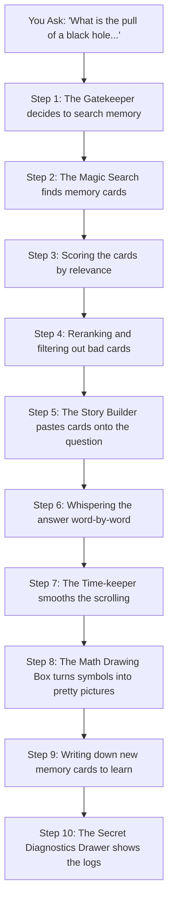

# How Jessie's Magic Mind Works 🧠✨

Hello friend! This is the complete storybook of **Jessie**, your very own custom-built magic research assistant. 

Jessie is not a regular computer program. She is a specialized AI built **just for you**, trained by reading more than **500+ million big research papers**! That is a mountain of science books higher than the clouds. Because she knows so much science, she can explain the secrets of the universe to you.

Let's take a journey deep inside Jessie's brain to see exactly how she hears you, thinks, and responds!

---

## 🗺️ The Map of Jessie's World

If you want to look at the secret blueprints of Jessie's home, you can find them here:
*   **The Main Thought Pipeline**: This is where Jessie's 10-step thinking process runs: [../src/utils/ai/gemini.ts](../src/utils/ai/gemini.ts).
*   **The Memory Sorting Engine**: This is the scale Jessie uses to weigh how important different memories are: [../src/utils/pipeline/pipeline.ts](../src/utils/pipeline/pipeline.ts).
*   **The House Layout**: This is the blueprint of what the screen looks like: [./chat_page_structure.md](./chat_page_structure.md).

---

## 🚀 The 10 Magic Steps (With a Live Example!)

To understand how Jessie works, let's pretend you type this question into the prompt composer:

> **"What is the pull of a black hole when I am far away versus when I am close?"**

Here is what happens in Jessie's mind, step-by-step:

---

### Step 1: The Magic Gatekeeper (Retrieval Decision) 🚪

**What Jessie does:** 
Before opening her big drawer of memories, Jessie reads your question and asks: *"Is my friend asking a science question where I should check my notes, or are they just saying 'hi'?"* 

*   **In our example:** Jessie reads *"What is the pull of a black hole..."* She says: *"Ooh! This is a deep science question. I definitely need to open my notes box!"*
*   **Decision:** **YES, memory search is required.**
*   **Where it lives in code:** `Step 1` in [../src/utils/ai/gemini.ts](../src/utils/ai/gemini.ts).

---

### Step 2: The Magic Search (RAG Retrieval) 🔍

**What Jessie does:**
Jessie opens a drawer filled with little cards containing your past conversations and physics notes. She uses a math tool (like a metal detector) to scan all the cards and find the ones that talk about "black holes" or "gravity".

*   **In our example:** Jessie scans the box and finds three cards:
    *   **Card A:** *"My friend is studying Schwarzschild black holes and gravity."*
    *   **Card B:** *"My friend wants to learn the difference between Newton and Einstein."*
    *   **Card C:** *"Remember to write gravity equations clearly for my friend."*
*   **Where it lives in code:** `Step 2` in [../src/utils/ai/gemini.ts](../src/utils/ai/gemini.ts).

---

### Step 3: Weighing the Cards (Similarity Match) ⚖️

**What Jessie does:**
Jessie looks at the cards she pulled out and rates them using a mathematical scale. She checks:
1.  **Keyword Match:** Does the card use the exact words from the question?
2.  **Meaning Match:** Does the card mean the same thing, even if the words are slightly different?
3.  **Recency:** Is this a new card we wrote recently, or an old one?

*   **In our example:** 
    *   **Card A** matches the words "black hole" and "gravity" perfectly! It gets a very high math score.
    *   **Card B** and **Card C** get medium scores.
*   **Where it lives in code:** `Step 3` in [../src/utils/ai/gemini.ts](../src/utils/ai/gemini.ts).

---

### Step 4: The Best Card Picker (Reranker) 🎯

**What Jessie does:**
Jessie lays the highest-scoring cards on her table. She reads them one-by-one to decide if they are truly useful for answering the question. She sorts them from best to worst and throws away cards with low ratings.

*   **In our example:** 
    *   **Card A** gets a **5-Star Rating** ⭐⭐⭐⭐⭐. It goes to the top.
    *   **Card B** gets a **4-Star Rating** ⭐⭐⭐⭐. It stays in the pile.
    *   **Card C** gets a **1-Star Rating** ⭐. Jessie discards it because it's just a general styling reminder.
*   **Where it lives in code:** `Step 4` in [../src/utils/ai/gemini.ts](../src/utils/ai/gemini.ts).

---

### Step 5: The Story Builder (Context Synthesis) 📝

**What Jessie does:**
Jessie takes a large clean sheet of paper. She writes down the helpful memories at the top, and then writes your question at the bottom. This ensures she doesn't forget who you are or what you've already discussed!

*   **In our example:** Jessie writes:
    > *"Memory 1: My friend is studying Schwarzschild black holes."*
    > *"Memory 2: My friend is comparing Newton and Einstein."*
    > *"Question: What is the pull of a black hole when I am far away vs. when I am close?"*
*   **Where it lives in code:** `Step 5` in [../src/utils/ai/gemini.ts](../src/utils/ai/gemini.ts).

---

### Step 6: Whispering the Answer (Response Streaming) 🗣️

**What Jessie does:**
Instead of sitting silently for ages to think of the whole answer, Jessie starts talking to you immediately! She sends her words to your screen one-by-one, like a stream of bubbles.

*   **In our example:** Jessie begins to print:
    > *"When... you... are... far... away..."*
*   **Where it lives in code:** `Step 8` in [../src/utils/ai/gemini.ts](../src/utils/ai/gemini.ts).

---

### Step 7: The Time-keeper (Chunk Throttling) ⏱️

**What Jessie does:**
If Jessie talks too fast, your screen will shake and stutter as it tries to scroll down. To stop this, a tiny helper named **Throttle** watches the clock. It collects Jessie's words and only updates your screen once every 100 milliseconds (which is faster than you can blink!).

*   **In our example:** Even if Jessie thinks of 50 words in a millisecond, the screen displays them in a smooth, continuous wave that is comfortable to read.
*   **Where it lives in code:** `throttledOnChunk` helper in [../src/utils/ai/gemini.ts](../src/utils/ai/gemini.ts).

---

### Step 8: The Math Drawing Box (MathML Parser) 🎨

**What Jessie does:**
When Jessie writes complicated math formulas, she writes them in code (like `\frac{a}{b}`). Our screen has a special drawing tool that captures this code and translates it into beautiful, easy-to-read math symbols on your screen!

*   **In our example:** Jessie writes: *"When you are far away, the pull follows: $F = G\frac{Mm}{r^2}$"*. The Math Drawing Box captures `$F = G\frac{Mm}{r^2}$` and displays:
    
$$F = G\frac{Mm}{r^2}$$

*   **Sizing Rule:** The drawing tool makes sure the letters (like $M$, $m$, and $r$) are scaled to match the rest of the text so you don't have to squint!
*   **Where it lives in code:** [../src/utils/pipeline/pipeline.ts](../src/utils/pipeline/pipeline.ts) and [../src/components/chatpage/chat/ui/markdowns/MarkdownRenderer.tsx](../src/components/chatpage/chat/ui/markdowns/MarkdownRenderer.tsx).

---

### Step 9: Learning New Things (Memory Classifier) 💾

**What Jessie does:**
Once Jessie finishes talking, she reviews the conversation in her head. She asks herself: *"Did my friend share a new preference, fact, or topic that I should write down on a card for next time?"*

*   **In our example:** Jessie realizes: *"Ooh! My friend is interested in gravity forces near event horizons!"* 
*   **Action:** She writes a new memory card: *"My friend is interested in gravity forces near event horizons."* She converts it into a math vector and slides it into her memory drawer.
*   **Where it lives in code:** `Step 9` in [../src/utils/ai/gemini.ts](../src/utils/ai/gemini.ts).

---

### Step 10: The Secret Diagnostics Drawer (Pipeline Trace) 📂

**What Jessie does:**
At the bottom of Jessie's response on your screen, you will see a small container labeled `PIPELINE_DIAGNOSTICS`. 

*   **Action:** If you click on it, it unfolds a secret accordion drawer. It shows you exactly how Jessie rated your cards, what memories she checked, and whether she saved a new card in Step 9!
*   **Where it lives in code:** [../src/components/chatpage/chat/ui/ArchitectureTraceBlock.tsx](../src/components/components/chatpage/chat/ui/ArchitectureTraceBlock.tsx).

---

## 🎨 Jessie's Visual Features

Jessie's home is styled to look clean, modern, and premium:
1.  **Sleek Tables:** When Jessie wants to compare concepts, she creates beautiful glassmorphic tables with custom alignments, rounded corners, and soft white headers.
2.  **No Ugly Borders:** Scrollbars on the right are customized into thin, semi-transparent cylinders that blend into the dark background, keeping the focus entirely on the science!
3.  **Adaptive Width:** The chat text box automatically widens and shrinks smoothly when you open or close sidebars.
